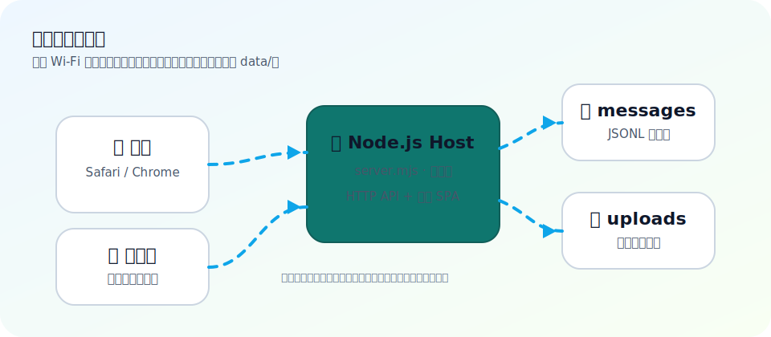
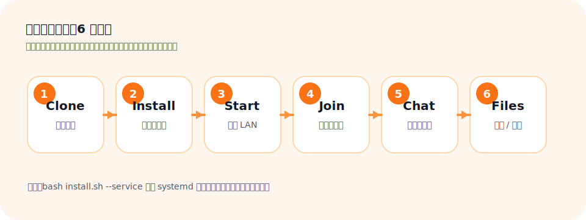
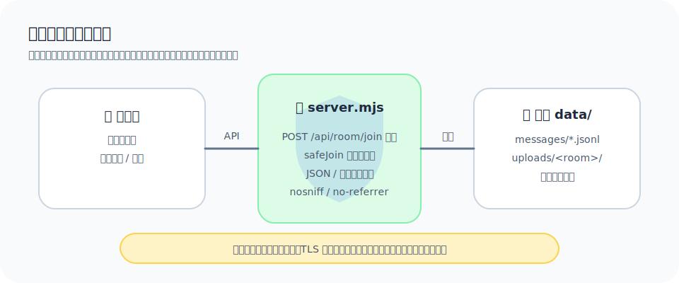

# 🏠 easy-LocalHub

<p align="center">
  <strong>Zero dependencies · One-command setup · LAN collaboration with data kept on your own machine</strong>
</p>

<p align="center">
  <a href="#-quick-start">Quick Start</a> ·
  <a href="#-feature-map">Feature Map</a> ·
  <a href="#-diagrams">Diagrams</a> ·
  <a href="#-security-boundaries">Security</a> ·
  <a href="#-faq">FAQ</a>
</p>

<p align="center">
  <strong>Language:</strong> <a href="README.md">简体中文</a> · English
</p>

> Turn one computer into a temporary collaboration hub for everyone on the same Wi‑Fi. Friends open a browser, enter the room code, then chat, upload files, and download shared files. No database and no `npm install`; messages and uploads stay on the host machine.

---

## ✨ When is it useful?

| Scenario | What you get |
| --- | --- |
| Meeting room / classroom handouts | Devices on the same Wi‑Fi can open the LAN URL and download files directly. |
| Phone ↔ computer file transfer | Upload from a browser and store files locally on the host. |
| Temporary small-team communication | Simple group chat with persisted messages. |
| Avoiding cloud storage for local sharing | Data is written only to the local `data/` directory. |

---

## 🎯 Feature Map

- 📂 **File relay**: drag and drop files or whole folders while preserving folder structure.
- 💬 **Group chat**: messages are persisted as JSONL and survive page refreshes.
- 🔑 **Room-code validation**: the server validates room joins; health checks do not reveal the room code.
- 📱 **Cross-platform access**: works from modern browsers on Windows, macOS, Linux, iOS, and Android.
- 🚀 **Zero-dependency runtime**: pure Node.js HTTP server; no npm packages required.
- 🔄 **Optional autostart**: can be installed as a systemd user service.
- 🛡️ **Basic hardening**: path boundary checks, input length limits, response security headers, and upload size limits.

---

## 🖼️ Diagrams

### 1. LAN collaboration architecture



### 2. Setup-to-collaboration workflow



### 3. Data boundaries and security hardening



---

## 🚀 Quick Start

```bash
# 1. Clone to your computer
git clone https://github.com/zeyuShawn/easy-LocalHub.git
cd easy-LocalHub

# 2. Run first-time setup and choose a room code
bash install.sh

# 3. Start the service
node server.mjs
```

The terminal will print something like:

```text
🚀 easy-LocalHub running!
   Local:   http://localhost:8080/
   LAN:     http://192.168.1.100:8080/

🔑 Room code: 123456
```

Share the **LAN URL** and **room code** with participants on the same Wi‑Fi:

1. Open the LAN URL in a browser.
2. Enter the room code.
3. Choose a nickname.
4. Start chatting, uploading, or downloading files.

---

## 🔧 Autostart (optional)

```bash
bash install.sh --service
```

After installing the systemd user service, manage it with:

```bash
systemctl --user status easy-localhub    # Check status
systemctl --user restart easy-localhub   # Restart
systemctl --user stop easy-localhub      # Stop
journalctl --user -u easy-localhub -f    # Follow logs
```

---

## ⚙️ Configuration

`install.sh` guides you through first-time setup. You can also edit `config.json` manually:

```json
{
  "roomCode": "123456",
  "roomName": "My Room",
  "ports": [8080, 8081, 8082, 8083, 8084, 8085]
}
```

| Field | Description |
| --- | --- |
| `roomCode` | Required to join the room and access room APIs. |
| `roomName` | Display name for the room. |
| `ports` | Candidate ports; the service uses the first available one. |

---

## 📁 Project Structure

```text
easy-LocalHub/
├── server.mjs                 # HTTP service (zero-dependency Node.js)
├── public/
│   └── index.html             # Frontend SPA (chat + file manager)
├── docs/
│   └── images/                # README SVG diagrams
├── install.sh                 # First-time setup + optional systemd service
├── generate-guide.sh          # Generate HTML/PDF guide
├── config.example.json        # Example configuration
├── easy-LocalHub-Guide.pdf    # User guide PDF
├── README.md                  # Chinese README
├── README.en.md               # English README
└── LICENSE                    # MIT
```

After running `install.sh`, these local files/directories are generated:

```text
├── config.json                # Your room code and port configuration (gitignored)
└── data/                      # Messages, uploads, and runtime port file (gitignored)
```

---

## 🧭 API and Data Flow

| Capability | Path | Description |
| --- | --- | --- |
| Health check | `GET /api/health` | Returns service status and LAN IPs; does not return the room code. |
| Join room | `POST /api/room/join` | Server-side room-code validation. |
| Fetch messages | `GET /api/room/:code/messages` | Returns recent messages, defaulting to at most 200. |
| Send message | `POST /api/room/:code/messages` | Writes to `data/messages/<code>.jsonl`. |
| Upload files | `POST /api/room/:code/upload` | Writes to `data/uploads/<code>/`; request limit is 256 MB. |
| List files | `GET /api/room/:code/files` | Recursively lists up to 5000 files/directories. |
| Download file | `GET /api/room/:code/files/:path` | Cleans the path and checks directory boundaries before serving. |

---

## 🛡️ Security Boundaries

### Built-in basic protections

- The health endpoint does not return the room code.
- The frontend calls `POST /api/room/join`; joining is not only checked in the browser.
- Upload and download paths are cleaned and checked with `safeJoin` to reduce path traversal risk.
- JSON request bodies, usernames, and message text have size/length limits.
- Responses include `X-Content-Type-Options: nosniff`, `Referrer-Policy: no-referrer`, and `Cache-Control: no-store`.

### What you still need to know

- This project is intended for **trusted LAN usage**, not as a public internet file server.
- The room code is the main access control; choose a non-trivial code and share it only with trusted participants.
- Uploaded files are not virus-scanned; verify files before opening them.
- For internet exposure, add HTTPS, reverse-proxy authentication, access logs, rate limiting, and malware scanning.

---

## 📖 PDF User Guide

The repository includes a guide generator:

```bash
bash generate-guide.sh
# Output: easy-LocalHub-Guide.pdf
```

If no PDF converter is available, the script keeps the generated HTML guide so you can open it in a browser and print to PDF.

---

## ✅ Requirements

| Role | Requirement |
| --- | --- |
| Server | Node.js 18+; Debian/Ubuntu recommended for Linux; macOS/Windows can run `node server.mjs` manually. |
| Client | Any modern browser: Chrome / Safari / Firefox / Edge. |
| Network | Client devices and host are on the same LAN, and the host firewall allows the selected port. |

---

## ❓ FAQ

<details>
<summary>Other devices cannot open the LAN URL. What should I check?</summary>

- Make sure all devices are on the same Wi‑Fi / LAN.
- Make sure the host firewall allows the current port (8080 by default).
- Verify that the LAN URL printed in the terminal belongs to the active network adapter.

</details>

<details>
<summary>What if the port is already in use?</summary>

The service tries ports in the order listed in `config.json`. Add more candidates if needed:

```json
{
  "ports": [8080, 8081, 8090, 9000]
}
```

</details>

<details>
<summary>What if a large upload fails?</summary>

The current request upload limit is 256 MB. Split the file, compress the folder, or adjust `MAX_UPLOAD` in `server.mjs` if you trust the environment.

</details>

<details>
<summary>Where is data stored, and how do I clean it?</summary>

- Messages: `data/messages/`
- Files: `data/uploads/`
- Current port: `data/port.txt`

Stop the service and delete the relevant files/directories to clear history.

</details>

---

## 📜 License

MIT
